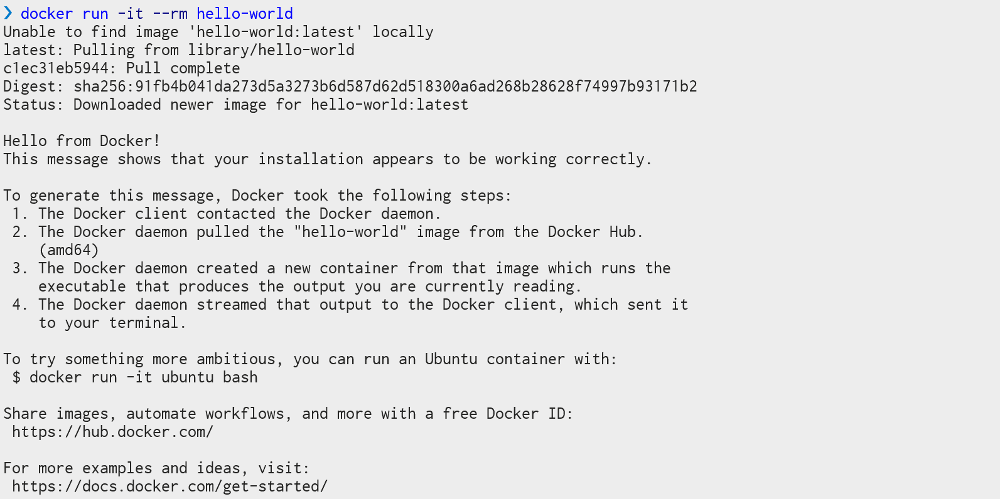
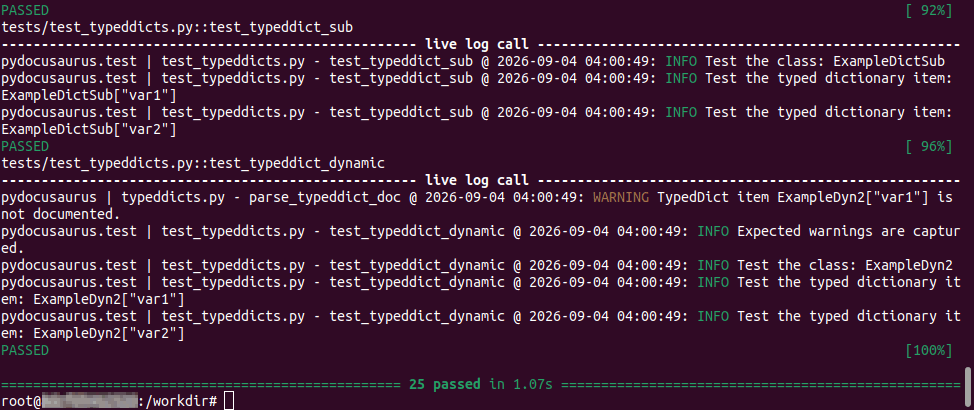
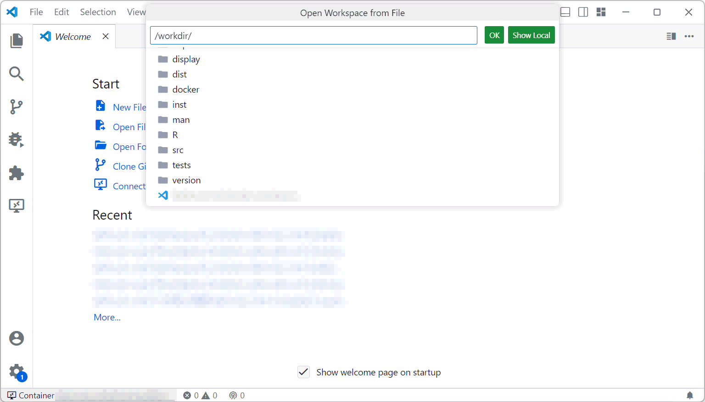

# pyDocusaurus: Convert your Python docstrings to Docusaurus Documentation

## CONTRIBUTING

This guide shows how to compile and test this project. Anyone who want to contribute to these codes can follow this guide and submit the pull request. [Section 2 :bookmark:](#2-work-with-docker) and [Section 3 :bookmark:](#3-work-with-conda) suggests how to work with Docker or Conda, respectively. Please choose either of these tools to deploy the environment and develop this project.

> [!CAUTION]
> We strongly suggest users to prepare the environment by Docker (see [2.1. :bookmark:](#21-install-by-docker)).
> Docker is supported by both Linux and Windows. Using Docker can save a lot of steps and mitigate issues caused by the path.

### 1. Explanations for the source codes

- Review our [code of conduct :memo:](./CODE_OF_CONDUCT.md) before contributing to this project.

- The metadata of the project is defined in `pyproject.toml`. Some metadata are dynamically solved from the other files, like the package version. Therefore, users need to ensure changes are done in the correct places if any part of the metadata needs to be changed.

- The Python codes are in the package `pydocusaurus/` folder. These codes are formatted by [`black`:hammer:][tool-black]. Note that the automatically generated files (may be introduced in the future) will not be formatted.

- The extra demos are stored in `examples/`. These demos show the usages this package in different cases.

- The unit tests are defined in the `tests/` folder.

- The `version/` folder is only used for helping `pyproject.toml` fetch the current version.

- The tool configurations for `pytest`, `black`, and `pyright` are defined in `pyproject.toml`. However, the configurations for `flake8` and `pylint` are still kept in their corresponding configurations files.

- Remember to use [`black`:hammer:][tool-black] to format any modified Python codes. Review your code before sending the pull request.

### 2. Work with Docker

#### 2.1. Install by Docker

If you choose to use Docker. The only software you need to install is `docker` itself. Check the following guide to install Docker on your device:

https://docs.docker.com/get-started/get-docker/

After installing docker, test whether it works or not by

```sh
docker run -it --rm hello-world
```

You should be able to see the message like this, which shows that `docker` is working well:



Then, build the docker image by

```sh
docker build -t pydocusaurus:latest https://github.com/cainmagi/pydocusaurus.git
```

This step may take a little bit long. After successfully building the image, you can start working on this project.

#### 2.2. Test the codes

Run the following command to start the tests.

```sh
docker run -it --rm pydocusaurus:latest
```

If the codes have not been modified, you suppose to see the the messages like this:



It shows that all unit tests get passed.

#### 2.3. Develop the project

To modify the scripts, you may want to clone an Git repository by yourself:

```sh
git clone https://github.com/cainmagi/pydocusaurus
```

Then, enter the cloned folder `pydocusaurus`, and run the following command:

```sh
docker compose up
```

When the container is running, you should be able to see a running compose session (not interactive).

Please leave the container open, and follow this guide to **attach your VSCode to the running container ``**:

https://code.visualstudio.com/docs/devcontainers/attach-container



At the **bottom left** corner, you should be able to see the name of the current container. When you open a new workspace, you should be able to find the the project in `/workdir`.

Now you will be able to start the development in the VSCode dev container. You can do the following things to test the codes.

- Run the `pytest`:

  ```sh
  python -m pytest
  ```

- Format the python codes

  ```sh
  black .
  ```

- Run an example

  ```sh
  python -m examples.convert
  ```

  Available examples are:

  | <center>Example</center> | <center>Description</center>                        |
  | :----------------------- | :-------------------------------------------------- |
  | `convert`                | Convert a package into a documentation folder.      |
  | `custom_saver`           | Convert a pacakge into a single documentation file. |
  | `single_obj`             | Convert a specific object as a documentation page.  |

- Build the python pacakge

  ```sh
  python -m build
  ```

Before submitting a pull request, please ensure that all unit tests (`pytest`) get passed and the codes are formatted by `black`.

After finishing your work, please open the console where the `docker compose` session is running. Hit <kbd>Ctrl</kbd>+<kbd>C</kbd> to stop the session. In the same console, run

```sh
docker compose down
```

to release all resources.

### 3. Debug and run unit tests via package installation

If the Docker container is not in use, users can still run unit tests for specialized functionality. For example, the minimal unit tests can be run by

```sh
git clone -d 1 --single-branch https://github.com/cainmagi/pydocusaurus.git
cd pydocusaurus
python -m pip install -e .
pytest
```

When running `pytest`, the unit tests can detect which optional functionalities are available automatically.

[tool-black]: https://marketplace.visualstudio.com/items?itemName=ms-python.black-formatter
